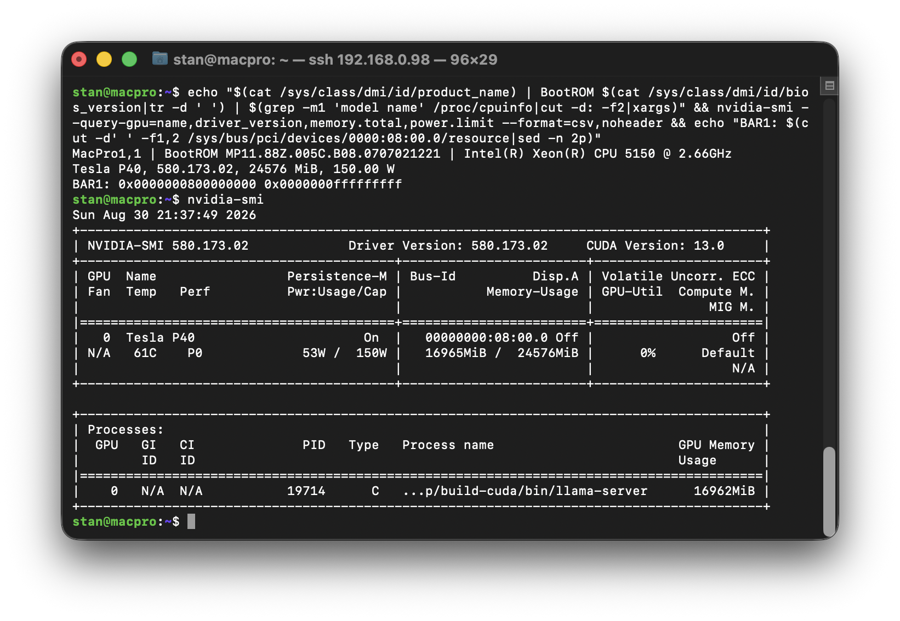

# Tesla P40 in a Mac Pro 1,1 (2006)

Running a 24 GB NVIDIA Tesla P40 — a card with a **32 GB PCI BAR** — in a
2006 Mac Pro whose firmware is **32-bit EFI**, with CUDA working.



Host: MacPro1,1, 2× Xeon 5150, 8 GB, BootROM `MP11.88Z.005C.B08`, Ubuntu 26.04.
Running a 27B model (Q4_K_M, 16 GB) entirely in VRAM: **12.5 tok/s** baseline,
**17.8 tok/s** with MTP speculative decoding, at a 150 W cap
([`docs/benchmarks.md`](docs/benchmarks.md)).

This repo is the how-to: a firmware patch, a kernel module, and the
surrounding setup needed to reproduce it. Start at
[Bring-up order](#bring-up-order).

## The problem

Stock, the machine **does not POST** with the card installed — no video, no
network, no disk activity. Two independent obstacles:

1. **Firmware hangs during PCI enumeration.** `PciBusDxe` cannot satisfy a
   32 GB BAR from its ~2 GB window (`0x80000000–0xFE000000`), returns
   `EFI_OUT_OF_RESOURCES`, and a caller ASSERTs into `CpuDeadLoop()`.
2. **Linux cannot place the BAR either.** 32 GB needs 32 GB alignment; in
   36-bit physical space (64 GB) the only slot above RAM is `0x800000000`,
   and a BAR there fills the address space to the last byte — leaving no room
   for the device's other prefetchable BAR in the same bridge window. The
   kernel releases the window, fails, and gives up on both.

Fixing either alone is not enough. This repo fixes both.

## Part 1 — `firmware/`: patched BootROM

Adds an entry to the firmware's `IncompatiblePciDeviceSupport` override table
(module `ad70855e-0cc5-4abf-8979-be762a949ea3`) declaring the P40's BAR1 as
256 MB. Firmware then allocates something it *can* satisfy and POST completes.
The hardware BAR is unchanged — this only stops the firmware choking.

```
DEVICE_INF_TAG  Vendor=0x10DE Device=0x1B38 Rev/SubVen/SubDev=0xFFFF
DEVICE_RES_TAG  ResType=0(MEM) AddrRangeMax=0x0FFFFFFF
                AddrTranslationOffset=1(BAR index) AddrLen=0x10000000
```

Usage — **on your own ROM dump, never someone else's**:

```bash
pip install uefi_firmware pefile
sudo flashrom -p internal:laptop=this_is_not_a_laptop -c M50FW016 -r bootrom.bin
python3 firmware/build_patch.py bootrom.bin bootrom_patched.bin
python3 firmware/validate.py  bootrom.bin bootrom_patched.bin   # ALL CHECKS PASSED
```

Everything is discovered from your own image — the volume, the module (by
GUID), the override table and which entry to reuse. Nothing is hardcoded to
one machine's dump. Other cards:

```bash
python3 firmware/build_patch.py in.bin out.bin \
        --vendor 0x10de --device 0x1b38 --bar 1 --size 256M
```

Integrity is **checksums only, no cryptographic signatures** — FV header
(16-bit sum), FFS header and data (8-bit sums, `ATTRIB_CHECKSUM` set on every
file) and a CRC32 guided section. `build_patch.py` recomputes all four.

### Flashing

The flash is an **ST M50FW016, 2 MB, FWH** (*not* SPI — a CH341A cannot
program it). The chipset lock is open (`BIOS_CNTL=0x00`, `BLE=0`), but the
FWH's own block-lock registers are set with **lock-down**, which only a reset
clears. A normal boot therefore refuses to erase:

```
Changing lock bits failed ... New value: 0x03   (Write Lock + Lock Down)
ERASE FAILED!
```

Writing requires entering the machine's **firmware-update boot state**, which
leaves the FWH blocks unlocked. Without it the erase aborts and nothing is
written:

1. **Fully shut the machine down** (not a reboot — it must be powered off).
2. **Press and hold the power button.** Keep holding.
3. The front **LED flashes rapidly** and you hear a **long, loud beep**.
4. **Release** on that beep. The machine boots normally, but the flash chip is
   now unlocked.

Boot into Linux as usual and flash within that session:

```bash
sudo flashrom -p internal:laptop=this_is_not_a_laptop -c M50FW016 \
     -w bootrom_patched.bin -V
```

You will see `UNLOCK:` in the erase output instead of
`WP|TBL#|WP#,ABORT` — that is how you know the state took. The unlock lasts
only until the next reset, so a plain reboot puts the lock-down back.

Read it back and compare **before rebooting**. On a verify mismatch, re-flash
the original immediately — once you power cycle, recovery needs external FWH
programming hardware.

## Part 2 — `bigbar/`: kernel module

Places the oversized BAR where Linux won't, and rehomes the rest:

```
BAR1 (32GB) -> 0x800000000-0xfffffffff   prefetchable window (top of 36-bit space)
BAR3 (32MB) -> 0x90000000                rebuilt non-prefetchable window
BAR0 (16MB) -> 0x92000000                (moved: the window must contain both)
```

It is **device-agnostic** — it scans for any unassigned memory BAR at or above
`min_size` rather than matching the P40 specifically.

```bash
cd bigbar && make
sudo insmod bigbar.ko dry_run=1     # report only, changes nothing
sudo insmod bigbar.ko
```

Parameters: `min_size` (default 256 MB), `low_base` (default `0x90000000` —
must be free, check `/proc/iomem`), `dry_run`, `phys_bits`.

Persistence — it **must** load before the GPU driver, or BAR1 is unassigned
and the driver fails:

```bash
sudo cp bigbar/dkms.conf bigbar/bigbar.c bigbar/Makefile /usr/src/bigbar-1.0/
sudo dkms add -m bigbar -v 1.0 && sudo dkms install -m bigbar -v 1.0
printf 'softdep nvidia pre: bigbar\nsoftdep nouveau pre: bigbar\n' \
    | sudo tee /etc/modprobe.d/bigbar.conf
```

## Findings

Notes on the non-obvious bits.

**The Intel 5000X *does* decode MMIO above 4 GB.** Intel's datasheet never
says so. Verified empirically by reading live data at `0x800000000` through
`/dev/mem` (`tools/bartest.py`) — the GP102 chip ID `0x132000a1` reads back
from BAR0 and real VRAM contents from BAR1.

**Hand-built PCI resources must include the BAR's low nibble.** Linux's
`decode_bar()` seeds `resource->flags` with `bar & ~PCI_BASE_ADDRESS_MEM_MASK`
*before* OR-ing the `IORESOURCE_*` bits. NVIDIA's
`nv_bar_index_to_os_bar_index()` tests `flags & PCI_BASE_ADDRESS_MEM_TYPE_64`
(`0x4`, one of those low bits) to decide whether a BAR consumes one PCI slot
or two. Build flags from `IORESOURCE_*` alone and a 64-bit BAR looks 32-bit,
so the driver resolves its "BAR2" to PCI index 2 — the empty high half — and
fails with `NVRM: BAR2 is 0M @ 0x0`. nouveau does not use that heuristic, so
it works with the same layout — useful as a check that the PCI side is right
before blaming it.

**Write bridge windows uppers-first, limit last.** Setting the low limit while
the upper dwords are still zero makes the window briefly span the whole low
4 GB — including all RAM. The bridge starts claiming memory cycles and the
machine dies instantly. Park the window disabled (base > limit), set uppers,
then base, then limit.

**Never probe BAR sizes on a Type 1 header.** On a bridge, registers above
`0x14` are bus numbers and windows, not BARs. "Sizing" them writes `0xFFFFFFFF`
into the secondary/subordinate bus numbers.

**`pci_enable_device()` rejects any BAR whose resource has no parent** —
`can't enable device: BAR n not claimed`. Filling in `start`/`end` is not
enough; the resource must be inserted into the tree (`pci_claim_resource()`).

**BAR size is fixed in hardware.** Firmware overrides change only what the
firmware *allocates*; the card still decodes its full 32 GB.

**Bridge non-prefetchable windows are 32-bit only**, so anything above 4 GB
must live in the prefetchable window — which is why BAR1 monopolises it and
everything else has to move below 4 GB.

## Other machines and other cards

Everything here was developed and tested on **one** configuration: a MacPro1,1
with a Tesla P40. Nothing else has been tried. The approach should generalise,
but treat all of the below as untested.

**Other Mac Pros.** The MacPro2,1 is the same logic board and firmware family
and is the most likely to work unchanged. The 3,1 and later have 64-bit EFI,
so they do not have the firmware half of this problem at all — though `bigbar`
may still be useful there, since the BAR-placement arithmetic is a property of
the address space, not the firmware. `firmware/build_patch.py` discovers the
volume and module rather than assuming offsets, so it should cope with a
different ROM, but it has only ever been run against one.

**Other cards.** Any GPU whose BAR the firmware cannot place should behave the
same way — Tesla M40, P100, V100 and similar all have full-VRAM BARs. Pass
`--vendor`/`--device`/`--bar`/`--size` to target them. `bigbar` matches on BAR
size rather than device ID, so it needs no changes at all.

**Where it will stop working.** A BAR larger than 32 GB has nowhere to go in a
36-bit address space, so cards above 32 GB are out on this hardware regardless
of what the firmware does.

If you try another combination, the results are worth writing down — there is
very little published about any of this.

## Why bother

These machines are usually scrapped. The chassis is the reason not to: the
Mac Pro 1,1 has a genuinely good thermal design — straight-through airflow,
large low-RPM fans, and the space to mount a passively-cooled datacenter card
in front of them. A Tesla P40 has no fan and expects server airflow, which
most desktop cases cannot provide and this one can.

The result is a 2006 tower doing useful 24 GB inference work, built from two
things that were otherwise heading for landfill: an obsolete workstation and a
decommissioned datacenter GPU. Both are cheap precisely because nobody wants
them separately.

## Warnings

- **Never distribute a ROM image.** It contains the machine's serial number,
  hardware UUID and MAC addresses. Every machine must patch its own dump.
  `.gitignore` excludes `*.bin`/`*.scap` for this reason.
- **Keep a verified backup of the original ROM**, and understand that having
  the image is not the same as being able to restore it — that needs FWH
  programming hardware if the machine won't POST.
- **Power.** The P40 is a 250 W passively-cooled card. If it is fed from the
  logic board's 6-pin aux connectors (~75 W each), cap it to 150 W. The limit
  will **not** stick without a correctly-configured `nvidia-persistenced` —
  note that Ubuntu ships that daemon with `--no-persistence-mode`, so it
  reports healthy while doing nothing. See [`systemd/`](systemd/) for the full
  procedure and the three separate ways it fails.
- **No AVX.** The Xeon 5150 is x86-64-v1 (`ssse3`, no SSE4/AVX). The driver
  does not care, but CUDA userspace — PyTorch wheels, llama.cpp builds — must
  be built without AVX or it dies with illegal-instruction.

## Layout

```
firmware/  build_patch.py, validate.py     patch and verify the BootROM
bigbar/    bigbar.c, Makefile, dkms.conf   kernel module
systemd/   power limiting + persistence    units, overrides, tmpfiles rule
tools/     verify_pcibus.py, find_checkdevice.py, checkdump.py, bartest.py
docs/      install-ubuntu.md, analysis.md, benchmarks.md
```

## Bring-up order

Each step depends on the previous one; skipping any leaves a failure that
looks like a hardware fault.

0. **Get Linux installed.** On a 32-bit-EFI Mac the installer cannot boot,
   cannot finish, and leaves you with no user account and no SSH. See
   [`docs/install-ubuntu.md`](docs/install-ubuntu.md).
1. **Patch and flash the BootROM** (`firmware/`) — without it the machine will
   not POST with the card installed.
2. **Install bigbar via DKMS** (`bigbar/`) and add the softdep rule, so it
   loads before the GPU driver on every boot. Without it BAR1 is unassigned
   and the driver fails with `NVRM: BAR2 is 0M @ 0x0`.
3. **Load the nvidia driver** — add `nvidia` to `/etc/modules-load.d/`, since
   the P40 enumerates as a 3D controller with no display and udev does not
   autoload a driver for it.
4. **Configure persistence and the power limit** (`systemd/`).

Verify by rebooting and running `nvidia-smi` with no manual steps. A single
line that covers the lot:

```bash
echo "$(cat /sys/class/dmi/id/product_name) | BootROM $(cat /sys/class/dmi/id/bios_version|tr -d ' ') | $(grep -m1 'model name' /proc/cpuinfo|cut -d: -f2|xargs)" && nvidia-smi --query-gpu=name,driver_version,memory.total,power.limit --format=csv,noheader && echo "BAR1: $(cut -d' ' -f1,2 /sys/bus/pci/devices/0000:08:00.0/resource|sed -n 2p)"
```

```
MacPro1,1 | BootROM MP11.88Z.005C.B08.0707021221 | Intel(R) Xeon(R) CPU 5150 @ 2.66GHz
Tesla P40, 580.173.02, 24576 MiB, 150.00 W
BAR1: 0x0000000800000000 0x0000000fffffffff
```

`BAR1` sitting at 32 GB is the part that is not supposed to work on 32-bit
EFI — if you see that, both halves are doing their job.

## Gotchas

- **Don't install two driver branches.** A 550 `nvidia-smi` cannot talk to a
  580 kernel module; it reports "couldn't communicate with the NVIDIA driver",
  which reads like a hardware problem and isn't.
- **Reloading the nvidia driver resets the power limit** — restart
  `p40-powerlimit.service` afterwards.
- **A failed driver probe can revert the BARs.** The kernel restores its own
  config-space snapshot on reset, which is why bigbar calls `pci_save_state()`
  after programming. Symptom without it: `NVRM: ... has fallen off the bus`,
  with the bridge still holding bigbar's windows while the device silently
  reverted to firmware BARs.
- **Mask ACPI `gpe11`.** On MacPro1,1 it fires continuously and stalls disk
  I/O — loading a large model thrashes and can OOM. `systemd/mask-gpe11.service`
  applies it at boot; it resets on every reboot otherwise.
- **Build CUDA userspace with `GGML_NATIVE=ON`** (or equivalent). These CPUs
  are x86-64-v1, and generic builds emit SSE4+ instructions that die with
  `Illegal instruction`. See [`docs/benchmarks.md`](docs/benchmarks.md).
- **nouveau will claim the P40** if it loads first. It works (it enumerates
  all 24 GB) and is a useful sanity check, but it must be unbound before the
  NVIDIA driver can take the card:
  `echo 0000:08:00.0 | sudo tee /sys/bus/pci/drivers/nouveau/unbind`
